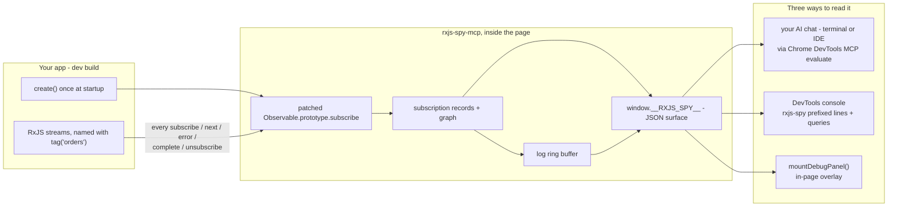
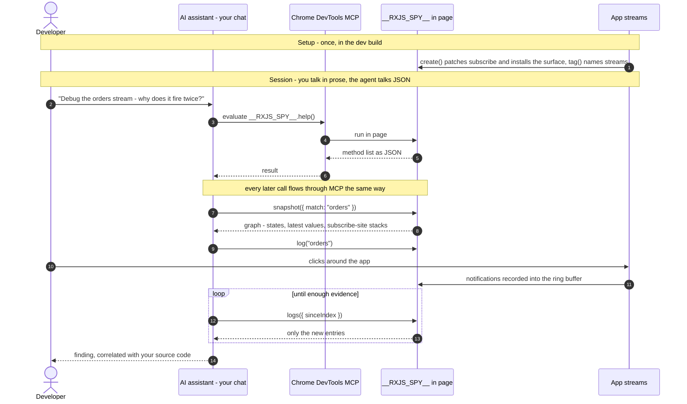
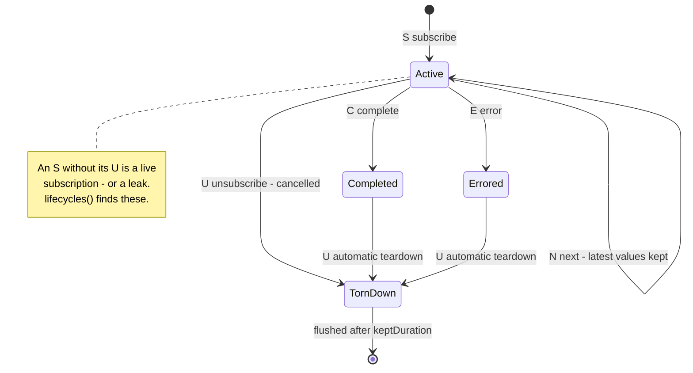

# rxjs-spy-mcp, explained

The debugger's output can look dense at first. This page explains the handful of ideas behind it — once you know them, every line of output becomes readable.

## The idea in one paragraph

RxJS code is hard to debug because the interesting things (values flowing, requests being cancelled, retries firing) happen *inside* composed observables where `console.log` can't see them. rxjs-spy-mcp fixes this in two moves: you **name** the streams you care about with `tag("some-name")` (which changes nothing about how they behave), and a **spy** watches every subscription in the page and records what happens. You then ask the spy questions — either by clicking around the harness's debugger panel, or by letting an AI agent query `window.__RXJS_SPY__` through Chrome DevTools MCP.

```ts
import { create } from "rxjs-spy";
import { tag } from "rxjs-spy/operators";

create(); // start spying (usually only in dev builds)

const results$ = queries$.pipe(
  tag("search.query"),          // <- a name, nothing more
  switchMap((q) => api(q)),
  tag("search.results"),
);
```

## The workflow, visualized

Where the data flows — `create()` patches `subscribe` so the spy sees *every* subscription, all state lives in the page, and one JSON surface feeds all three consumers:



And what one AI-assisted debugging session looks like — you talk in prose, the agent talks JSON, the answer lands in your chat:



### Anatomy of one call

The label "AI assistant in your chat via Chrome DevTools MCP evaluate" packs four things into one line:

- **your chat** — wherever you talk to your coding assistant: a Claude Code terminal session, VS Code's Copilot panel, Cursor. A terminal is not an IDE, and it does not need to be — all that matters is that this is where you type.
- **AI assistant** — the model answering there.
- **Chrome DevTools MCP** — a small helper program (an MCP server) on your machine that attaches to your running Chrome, the way DevTools does. The assistant uses it as a tool.
- **evaluate** — its key operation: *"run this JavaScript expression inside the page and hand back the result."*

One question, end to end:

1. **You** (in chat): *"which streams are running?"*
2. **Assistant** calls its tool: `evaluate("__RXJS_SPY__.listTags()")`
3. **The MCP server** forwards the expression into your Chrome tab, where the page executes it
4. **The page** returns plain JSON — `{ tags: [{ tag: "orders", active: 1, totalNext: 12 }] }` — back through the same pipe
5. **Assistant** reads the JSON and answers in chat: *"one stream, `orders`, active, 12 values so far."*

You did step 1 only — no DevTools opened, no JSON read, no command typed. The assistant repeats steps 2–4 with different expressions (`snapshot(...)`, `logs({ sinceIndex })`, `lifecycles()`) until it has enough evidence, then explains in prose.

(A standalone version with key points lives in [rxjs-spy-mcp-workflow.html](rxjs-spy-mcp-workflow.html) — open it in any browser.)

## The five events

Everything the spy reports is one of five notifications, and they mean exactly what they do in RxJS:

| Notification | Letter | Meaning |
|---|---|---|
| `subscribe` | `S` | someone started listening to the stream |
| `next` | `N` | the stream emitted a value (shown inline) |
| `error` | `E` | the stream failed (message + stack shown inline) |
| `complete` | `C` | the stream finished normally |
| `unsubscribe` | `U` | the subscription was torn down — always the final event |

Human-facing output (console lines, the harness panel) uses the compact letters — `[rxjs-spy] N orders.results 42` means "the `orders.results` stream emitted `42`". The JSON returned by `logs()` keeps the full words so agents never have to guess.

**The lifecycle grammar.** Every subscription's trace follows one fixed shape — `S`, then any number of `N`, then one of three endings:

```
S N N N ... C U    completed normally, then torn down
S N N ...   E U    errored, then torn down
S N ...       U    cancelled mid-flight (switchMap, takeUntil, .unsubscribe())
```

`U` always closes the lifecycle — the spy emits it even after `C`/`E`, because RxJS always tears down after a terminal notification. (`C` after `E` never occurs; they are mutually exclusive terminals.) As a state machine:



This gives you two powerful reading rules:

- **`E` followed by another `S` on the same tag = a retry.** `retry()` works by resubscribing, so each attempt shows as its own `S`...`E U` group.
- **An `S` with no matching `U` = a live subscription.** Fine while the stream should be running; a leak if it should not.

That second rule is built in as **`lifecycles()`** — the leak check. It scans every subscription record, renders its compact sequence, and returns the ones that are still missing their `U`, each with its age and the stack trace of the `.subscribe()` call that created it:

```js
__RXJS_SPY__.lifecycles({ olderThanMs: 60000 })
// {
//   summary: { records: 12, closed: 11, open: 1 },
//   open: [{ sequence: "SN×42", tag: "orders.results", ageMs: 754000,
//            stackTrace: ["at OrdersComponent.ngOnInit (orders.component.ts:31)", ...] }]
// }
```

An empty `open` list means every subscription ended with its `U` — unsubscribe ran everywhere. Entries in `open` are either streams that *should* still be live (your app's main subscriptions) or genuine leaks; `olderThanMs` and `match` narrow the list, and the harness has a "Check lifecycles" button doing the same.

## The subscription record

Every `subscribe` call creates one **record**. A record is always in exactly one state, shown in snapshots:

- `ACTIVE` — still running
- `completed` — finished normally
- `ERRORED` — died with an error (kept, with the error, so you can inspect it after the fact)
- `unsubscribed` — cancelled

Each record also keeps: its tag (if any), how many values it emitted (`next=N`), its **latest few values** (default 4), and the stack trace of where in your code `.subscribe()` was called. Closed records are kept for 30 seconds and then dropped, so snapshots show recent history, not everything since page load.

## The graph: why snapshots are trees

Observables are pipelines: when you subscribe to the end of a pipe, each stage subscribes to the stage before it. The spy records those relationships, so a snapshot is a tree:

- **Roots** are your application's own `.subscribe(...)` calls.
- **Nested rows** are the upstream stages feeding them.
- **`(flattened)`** marks an *inner* stream created mid-flight by an operator like `mergeMap`/`switchMap` — e.g. one HTTP request spawned per query.
- **Untagged rows** like `(Observable2)` are intermediate operator stages you didn't name. Skim past them; the tagged rows tell the story. (Tag more stages if you want more landmarks.)

Reading a real example:

```
search [ACTIVE] next=2                       <- your subscribe; got 2 results so far
    search.query [ACTIVE] next=3             <- 3 queries came through the debounce
      search.results [completed] (flattened) <- query #1's request: finished fine
      search.results [unsubscribed] (flattened) <- query #2's request: CANCELLED by switchMap
      search.results [completed] (flattened) <- query #3's request: finished fine
```

That one tree answers: how many requests were made, which were cancelled, which succeeded, and what they returned (`values=[...]`).

## The surface: `window.__RXJS_SPY__`

`create()` installs a global object whose methods all return plain JSON — that's what makes it drivable by an AI agent over MCP `evaluate_script`. In the order you'd typically use them:

| Call | The question it answers |
|---|---|
| `help()` | "What can this thing do?" — machine-readable method list |
| `status()` | "What's the overall state?" — counts, known tags, version |
| `listTags()` | "Which streams exist and how busy are they?" |
| `log("search")` | "Start recording everything that happens to `search`" |
| `logs({ sinceIndex: 0 })` | "Give me what was recorded since I last asked" |
| `snapshot({ match: "search" })` | "Show me the subscription tree for `search` right now" |
| `lifecycles({ olderThanMs? })` | "Did every subscription get its `U` — is anything leaking?" |
| `unlog()` / `flush()` | stop recording / drop closed records now |
| `teardown()` | stop spying entirely and restore RxJS untouched |

Two details that matter:

- **`logs()` is a ring buffer you poll.** Every recorded notification gets an increasing index. You call `logs({ sinceIndex: 0 })`, note the returned `nextIndex`, and pass it back next time — you only ever get new entries. This is how an agent "watches live" without scraping the console.
- **`match` is a string with three forms:** a tag (`"search"`), a regex (`"/^search/"` — matches `search`, `search.query`, `search.results`...), or an observable/record id number.

Values crossing this boundary are made JSON-safe and size-bounded: long strings are truncated, deep objects cut off, and things like functions or observables become short labels (`"[Observable #12 tag=search]"`). What you see is a faithful sketch, not a live reference. Properties whose keys look sensitive — `password`, `token`, `secret`, `authorization`, `cookie`, `apiKey`, and the like (substring match, so `accessToken` counts) — are **redacted by default**, since traces are meant to be read by an AI agent; override per call with `serialize: { redactKeys: [...] }` or disable with `redactKeys: []`.

## What Chrome DevTools MCP actually does here

A common first guess is that the AI reads the spy's console output and comments on it. That's the backup channel, not the mechanism. MCP gives the agent two ways in, and the design favors the first:

**Primary — the agent *calls* the spy; the console is not involved.** MCP's `evaluate_script` tool runs an expression in the page and hands back its return value. The agent literally executes `__RXJS_SPY__.snapshot({ match: "search" })` and receives the JSON tree *as the result of that call*. Asking a question means invoking a method:

| Question | Evaluate call |
|---|---|
| "What's running?" | `status()` / `listTags()` |
| "What did this stream emit?" | `log("search")`, then repeated `logs({ sinceIndex })` polls |
| "Why did this request die?" | `snapshot({ match: "/^search/" })` — states, errors, stack traces |
| "Is anything leaking?" | `lifecycles({ olderThanMs: 60000 })` |

The ring buffer behind `logs()` exists precisely so live values can be *pulled* through evaluate calls instead of read off the console.

**Secondary — console reading also works.** MCP has a console-messages tool, and the spy prefixes its lines (`[rxjs-spy] N search.query a`) exactly so they're filterable there. But console output is flat text mixed in with everything else your app logs — fine for a quick human glance, clumsy for a program. Fallback, not mechanism.

**And the answers land in your chat, not in the console.** The full loop: you ask in your AI chat — terminal or IDE ("why does the search stream fire twice?") → the agent drives `__RXJS_SPY__` in the browser through MCP evaluate calls → parses the JSON it gets back → explains the finding in the conversation, correlated with your source code. The browser page is just where the evidence lives; the conversation is where the debugging happens.

## Using it in your own project

Four steps: install the package, start the spy at app startup, tag the pipeline, then read the trace.

### 1. Install

Not on npm yet, so install from GitHub (the package builds itself on install):

```sh
npm install --save-dev github:hansschenker/rxjs-spy-mcp
```

Or from a local clone:

```sh
git clone https://github.com/hansschenker/rxjs-spy-mcp
cd rxjs-spy-mcp && npm install && npm run build
cd ../your-project && npm install --save-dev ../rxjs-spy-mcp
```

Either way the package **name stays `rxjs-spy`** — you import from `"rxjs-spy"` and `"rxjs-spy/operators"`. It needs rxjs `^7.8.0` as a peer, and there must be only **one copy of rxjs** in your `node_modules` (the spy patches the prototype of the rxjs *it* imports — run `npm ls rxjs` if in doubt; you should see a single deduped version).

### 2. Start the spy at startup, dev only

Call `create()` **once, before anything subscribes** — streams that subscribed earlier are invisible to it. Guard it so it never ships enabled to production:

```ts
// Angular — main.ts, before bootstrapping:
import { isDevMode } from "@angular/core";
import { create } from "rxjs-spy";

if (isDevMode()) create();
bootstrapApplication(AppComponent, appConfig);
```

```ts
// Vite (React/Vue/vanilla) — entry file:
if (import.meta.env.DEV) {
  const { create } = await import("rxjs-spy");
  create();
}
```

### 3. Tag the pipeline you want to trace

Drop `tag()` at every stage whose values you care about — each tag becomes a named checkpoint in the trace:

```ts
import { tag } from "rxjs-spy/operators";

this.results$ = this.query$.pipe(
  tag("orders.query"),                                    // what comes in
  debounceTime(300),
  tag("orders.query.debounced"),                          // what survives the debounce
  switchMap((q) => this.api.search(q).pipe(tag("orders.request"))), // each request
  tag("orders.results"),                                  // what the UI receives
);
```

`tag()` is behavior-neutral and near-zero-cost when no spy is active, so leaving tags in the codebase is fine.

### 4. Read the trace

Run your app in Chrome. The quickest way, straight in the DevTools console:

```js
__RXJS_SPY__.log("/^orders/")            // start recording; console lines get a [rxjs-spy] prefix
// ... use your app ...
__RXJS_SPY__.logs({ sinceIndex: 0 })     // the recorded timeline as JSON
__RXJS_SPY__.snapshot({ match: "/^orders/" }) // the subscription tree right now
__RXJS_SPY__.unlog()                     // stop recording
```

Or hand it to your AI assistant with Chrome DevTools MCP connected: *"Connect to my app's tab and debug the `orders` stream — snapshot its subscription graph and log its emitted values."* The agent runs the same calls and reads the JSON back.

For programmatic use (e.g. piping the trace into your own tooling), `create()` returns a `Spy` with the same capabilities: `spy.log(match, { console: false })`, `spy.logEntries(sinceIndex)`, `spy.snapshot()`, and `spy.teardown()` to stop spying and restore RxJS untouched.

### Optional: an in-page panel (no DevTools, no agent)

If you want to *see* the trace without opening the console, mount the built-in panel — a small self-contained overlay (status line + live S/N/E/C/U trace, inline styles, ~3 KB) that polls the spy inside your own page:

```ts
import { create } from "rxjs-spy";
import { mountDebugPanel } from "rxjs-spy/panel";

const spy = create();
if (import.meta.env.DEV) {
  mountDebugPanel(spy); // floating bottom-right; returns an unmount function
}
```

Options: `container` renders it into your own element instead of floating, `startLog: false` if you manage logs yourself, `console: true` to mirror lines to the console too, `intervalMs` for the poll rate. It ships as a separate `rxjs-spy/panel` entry, so production bundles never include it unless imported.

## Where to see it

- **Humans:** `npm run harness` — the page's right column is the debugger panel: a status line, the live log stream, and a "Take snapshot" button. The "Typeahead + flaky API" button runs a scripted scenario with a debounce collapse, a retry saga, and a mid-retry cancellation, so you can watch every concept above happen in a few seconds.
- **AI agents:** connect Chrome DevTools MCP to the tab and ask your assistant to debug a tagged stream. The recipe it follows: `help()` → `snapshot({ match })` → `log(match)` + poll `logs({ sinceIndex })`. A full annotated session is in [mcp-debug-session.md](mcp-debug-session.md).

## What it deliberately doesn't do (yet)

Pause/step-through of live streams, cycle detection, and stats from the original rxjs-spy v8 are not reimplemented yet — the plugin seam for them exists. The spy also can't see subscriptions made before `create()` ran, or streams wrapped in `hide()`.
